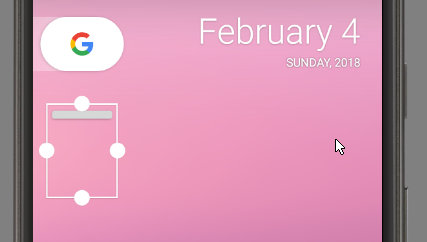

# 2018.01 Android Widget Development

## 2018.01.29

I installed Android Studio per the instructions on the website. I'm
pretty familiar with IntelliJ, so not bothering documenting all that.

My initial project idea is to learn about widgets and the system APIs
for creating a widget for dealing with alarms and timers. We'll see
how possible/practical this is.

I decided to use the latest API, 27, for Android 8.1 since I'm
interested in learning the newest recommendations and don't need my
personal apps running on other devices.

I also decided to use Kotlin since I've played with it before as a
Java alternative and like its reduced verbosity.

40 minutes of downloading and configuring (mostly downloading) got me
this starting point repo: https://github.com/philipwilcox/ClockManager

Note that I created this as an empty activity, not knowing anything
about them to guide my starting point otherwise.

Trying to run it out of the box gives me a dialog showing that I
already have a "Nexus 5X API 27 x86" virtual device, which seems fine
for now. I'll connect my phone later.
* It blows up with "Missing initial data partition file" wtf...
* https://stackoverflow.com/questions/47895124/emulator-emulator-error-missing-initial-data-partition-file well that's stupid, but yeah, running a second time fixed that, but it's actually failing on trying to load openGL drivers!
* Setting it to software graphics driver fixes that, seems there's an old bug that I need to work around for getting hardware graphics working later with Intel drivers... https://bbs.archlinux.org/viewtopic.php?id=213192

I'll pick up there later, bleh.

## 2018.01.30

Left off from yesterday with an emulator that wouldn't boot at all.
* Fixed booting with software graphics by creating a new Pixel profile emulator running Android 26 API x86\_64 image. Not sure if API version change or x86\_64 vs x86 that did the trick.
* Hardware graphics mode problem still exists.
  * Looking at https://askubuntu.com/questions/867081/android-studio-buggy-after-upgrade-to-16-10
  * Trying the `export ANDROID_EMULATOR_USE_SYSTEM_LIBS=1` in `.profile` suggestion. No luck even after restarting Android studio.
  * This did the trick, sigh:
    ```bash
    😊  [Tue Jan 30 12:45:20] philip@thinkphil25:~/Android 
    💰  cd ~/Android/Sdk/emulator/lib64
    😊  [Tue Jan 30 12:45:58] philip@thinkphil25:~/Android/Sdk/emulator/lib64 
    💰  mv libstdc++ libstdc++.bad
    ```

Now that I have an environment, I'll jump into coding later. Frustrating setup to have to debug before I can even do a hello world.

## 2018.02.01

Today I picked up by starting to write my own code. First task: try to
read the next alarm time from the system. One stackoverflow post
mentioned AlarmManager,
https://developer.android.com/reference/android/app/AlarmManager.html,
though it's unclear if this will work for system level alarms or just
scheduling events for the app.

Ended up with this after some kotlin kung-fu to convert the Java
example commands. I learned the cast from the interactive debugger:
```kotlin
var alarmManager = applicationContext.getSystemService(Context.ALARM_SERVICE);
var nextAlarm = (alarmManager as AlarmManager).nextAlarmClock
```

By default in an empty simulator, nextAlarm is null. Had to do a brief
digression to learn how to use the log: `Log.e` will print an
error-level log to the Logcat tab in Android Studio (which will color
it red for noticability), but I got my emulator confused and had to
restart Android Studio to get it to find the process correctly.

Next task: change the emulator to have an alarm set, and see if it
still comes back as `null`. *This works!* It gives me a non-null
`AlarmClockInfo` object with a numeric mTriggerTime. I can get that
trigger time into a string like so:
```kotlin
DateUtils.formatDateTime(applicationContext, nextAlarm.triggerTime, DateUtils.FORMAT_SHOW_DATE or DateUtils.FORMAT_SHOW_TIME)
```

Then `1517578200000` turns into `February 2, 8:30 AM`.

Note the "or" bitwise operator in Kotlin. :|

Speaking of, this looks handy:
https://kotlinlang.org/docs/reference/idioms.html - like this
if-not-null shorthand:
```kotlin
val files = File("Test").listFiles()

println(files?.size)
```
or execute if not null oddity:
```kotlin
val value = ...

value?.let {
    ... // execute this block if not null
}
```
(Are we sure this one's so great? Here's some discussion: https://discuss.kotlinlang.org/t/let-vs-if-not-null/3542 -- interesting how it turns the thing being tested into `it`, too, which shortens things a tiny bit in trivial cases but would be cool for more complex nested checks.)


## 2018.02.02

Today I'm backing up and studying some basics first:
* https://developer.android.com/guide/components/fundamentals.html
  * App components - basic building blocks. Four types:
	* Activities - entry point for interacting with user. Single screen w/ UI. By knowing what
      activity the user is in, the system can keep the right processes running, suspend the right
      processes, and save the right state for those processes, as well as sharing stuff app to app.
	* Services - entry point for running in the background. Performs long-running operations, or
      performs work for other processes. No UI.
	  * Started services tell the system to keep them running until work is done.
	  * Bound services run because another app says that it wants to use them, e.g. as an API for
        another process.
		> Live wallpapers, notification listeners, screen savers, input methods, accessibility services, and many other core system features are all built as services that applications implement and the system binds to when they should be running.
	* Broadcast receivers - the entry point to respond to system-wide announcements. This way
      broadcasts can hit even apps that aren't currently running. May create a status bar
      notification, but doesn't display UI.
	  > So, for example, an app can schedule an alarm to post a notification to tell the user about
	  > an upcoming event... and by delivering that alarm to a BroadcastReceiver of the app, there
	  > is no need for the app to remain running until the alarm goes off. Many broadcasts originate
	  > from the system—for example, a broadcast announcing that the screen has turned off, the
	  > battery is low, or a picture was captured. Apps can also initiate broadcasts—for example, to
	  > let other apps know that some data has been downloaded to the device and is available for
	  > them to use.
	  * Broadcasts are delivered as `Intent` objects.
	* Content providers - this lets *other apps* query shared app data that your app stores in
      persistent storage (local or web or wherever).
	  > For example, the Android system provides a content provider that manages the user's contact
	  > information. As such, any app with the proper permissions can query the content provider,
	  > such as ContactsContract.Data, to read and write information about a particular person.
	  * Need to think more about what this bit means, some more details on the page:
	  > It is tempting to think of a content provider as an abstraction on a database, because there
	  > is a lot of API and support built in to them for that common case. However, they have a
	  > different core purpose from a system-design perspective. To the system, a content provider
	  > is an entry point into an app for publishing named data items, identified by a URI scheme.
  * Activating components
	* Three of four are actived with an `Intent` object: Activities, services, and broadcast
      receivers.
	  * Start an activity, or change what it's doing, by passing `Intent` to `startActivity()` or
        `startActivityForResult()`, the latter meaning you want the result back from the activity.
	  * `JobScheduler` class can be used to schedule actions (sends the `Intent` to a service, seems
        like).
	  * Initiate a broadcast by passing an `Intent` to `sendBroadcast()` or similar.
	* ContentProviders activated when targeted by a request from a `ContentResolver`. This means
      calling `query()` on a `ContentResolver`.
  * Manifest file
	* App must declare all components in here, must be in root of app project dir
	* Also identifies permissions, minimum API level, hardware/software features used, and API
      libraries other than framework to link against.
	* __*I don't think I need to go deep into declaring components and capabilities for now...*__
  * App resources: images, audio, xml, blah blah blah.

All this structure stuff is good background context, but in keeping with my "add structure as proven
needed" approach, I'm not too worried about figuring out exactly what to put in what classes as
activities or services or other helpers or what, just right now. I'll figure that out as I go, to
avoid having to back out of a wrong design since I know very little right now anyway.

* https://developer.android.com/guide/components/activities/activity-lifecycle.html
  * My initial thinking is that I'll have an activity that triggers a service when it's opened to
    enable the widget and all, but I'll learn more there later.
  * Lifecycle callbacks for activities ensure that:
	* Multitasking works (user can receive a phone call or switch apps while in your app without
      breaking)
	* The app doesn't use too many resources when backgrounded
	* The user doesn't lose their progress when multitasking
	* The app handles screen rotation (welp, hadn't thought about this, design-wise, lol)
  * The core callbacks are:
    * `onCreate`
	* `onStart`
	* `onResume`
	* `onPause`
	* `onStop`
	* `onDestroy`

But again, I'll come back to the details of this later.

Going back to the question of managing the clock app's alarms:
* https://stackoverflow.com/questions/13909040/set-android-alarm-clock-programmatically This one
  isn't too encouraging. I need to make sure I'm talking to the clock, not just the system alarm
  scheduling stuff. What's puzzling me is that the get next alarm thing *does* respect alarms set
  there, not just own-app stuff.
* https://developer.android.com/reference/android/provider/AlarmClock.html Here's a provider for
  creating an Intent to start an Activity to set a new alarm or timer in an alarm clock app. What
  can I do with this...?
  
  >  Applications that wish to create a new alarm or timer should use Context.startActivity() so
  >  that the user has the option of choosing which alarm clock application to use.

  * https://developer.android.com/reference/android/provider/AlarmClock.html#ACTION_SHOW_ALARMS This
    will open a page to see alarms, but I want to show some in my own UI first, too...
	
  * https://developer.android.com/reference/android/provider/AlarmClock.html#ACTION_SHOW_TIMERS Same
    as above, but for timers.

Seems like one thing I should try is to schedule my own event with AlarmManager and then see if
  this preempts my access to seeing when the system alarm is set.
  * There's a broadcast action `ACTION_NEXT_ALARM_CLOCK_CHANGED` that indicates when that is
    changed, would want to listen to that too.
  * There's a few methods here for `set` and `cancel`, are they reflected in system alarm clock app?
  * And there seems to be no way to get the whole list of them... how do widgets show the next
    system alarm reliably, then??

If I can't manage the alarms directly, I could still implement my own timers since no need to
piggyback on system for that. But for wakeup alarm I really want to use the native UI so I have the
native snooze functionality and all. In that case the app is just TimerManager I guess.

---

Back to code and Kotlin, fun rediscovery: nullable things will come back as `Any!` by default from
Java calls, so I'll need to unbox them to have proper behavior, null safety, and
autocompletion. Basic info here: https://kotlinlang.org/docs/reference/null-safety.html

So doing something like `val alarmManager =
(applicationContext.getSystemService(Context.ALARM_SERVICE)) as AlarmManager` will give me an object
of the expected type but it's not clear to me yet if that's the prefered way. But doing a quick test confirms it behaves as I'd expect, at least: `val blah = (null as AlarmManager)` causes a fatal NPE, which is fine for now.

I also wasn't entirely clear on difference between `Any?` and `Any!`, but this seems to clear it up: https://stackoverflow.com/questions/43826699/single-exclamation-mark-in-kotlin - `Any!` is when Kotlin isn't sure if it's nullable or not for a "platform type."

__*Another side note to learn more about later: `icu` libraries in Android. Seems
internationalization-related.*__

This is an interesting discovery that wasn't clear from my reading of the docs: `nextAlarmClock`
ignores stuff set with `AlarmManager.set` even in the same process? See the following code:

```kotlin
val alarmManager = (applicationContext.getSystemService(Context.ALARM_SERVICE)) as AlarmManager
// Let's set a test alarm and see if that's what we get back instead
val calendar = Calendar.getInstance()
alarmManager.set(AlarmManager.RTC, calendar.getTimeInMillis() + 20000, null);

var nextAlarm = alarmManager.nextAlarmClock
Log.e("AlarmManager: ", "$nextAlarm")
nextAlarm?.let {
	var alarmString = DateUtils.formatDateTime(applicationContext, it.triggerTime,
			DateUtils.FORMAT_SHOW_DATE or DateUtils.FORMAT_SHOW_TIME)
	Log.e("AlarmManager", "Next alarm will trigger at $alarmString")
}
```

This ends up logging:
```
02-02 15:49:47.149 8734-8734/? E/AlarmManager: Next alarm will trigger at February 5, 8:30 AM
```

So that's curious, but it's still just one alarm, the next one, which is less useful and gives no
access to timers in the app. Time to find out if the AOSP/Pixel clock is a ContentProvider, I
guess. Seems probably hopeless based on
https://stackoverflow.com/questions/21553196/detect-default-alarm-clock-application-alarms so next
step will be to regroup and think about how to design app to store its own timers?

Though let's take a look at this: https://developer.android.com/guide/components/intents-common.html

> To show the list of alarms, use the `ACTION_SHOW_ALARMS` action.
>
> Although not many apps will invoke this intent (it's primarily used by system apps), any app that
> behaves as an alarm clock should implement this intent filter and respond by showing the list of
> current alarms.

Can I send that intent to a different app programatically?

There's also a `ACTION_SET_TIMER` action, and as a I noted above, a related one for showing them,
let's start playing around with those!


## 2018.02.03

First things first: let's find out how Intents work to use `ACTION_SET_TIMER`, `ACTION_SHOW_TIMERS`
and so on. (Side note: sounds like if I end up implementing my own timer system, I should be able to
respond to these intents.)

Looking at this doc:
https://developer.android.com/training/basics/firstapp/starting-activity.html#BuildIntent

I'm first trying a version with `startActivityForResult` to see what I get back for that intent, if
anything. Not sure exactly the significance of the `resultCode` yet, but I don't think it matters for
this trivial use.

Sample I used to test:
```kotlin
fun showTimers() {
	val intent = Intent(AlarmClock.ACTION_SHOW_TIMERS)
	startActivityForResult(intent, 3)
}

override fun onActivityResult(requestCode: Int, resultCode: Int, data: Intent?) {
	// Check which request we're responding to
	if (requestCode == 3) {
		// Make sure the request was successful
		if (resultCode == Activity.RESULT_OK) {
			Log.e("QuickTimer", "$data")
		}
	}
}
```

*(Emacs note aside: `indent-rigidly` and then the arrow codes will let me adjust the overall
indentation of a region with pasted code.)*

So from the above code snippet, I learned:
* `ACTION_SHOW_TIMERS` results in the system clock app being opened to the timers page. It didn't
  prompt to choose an app to handle with, probably because no other apps on the system could
  respond.
* The `Intent` object that came back to `onActivityResult` was `null` after using the back button to
  go back. There doesn't seem to be a way to pass data about the timers back. If I didn't have the
  `?` on the type declaration, it NPEs there.

So I can't use the system timers. Let's jump to widget-land before coming back to build a timer
setter of our own.

### Widgets

Design information for widgets: https://developer.android.com/design/patterns/widgets.html
* Mine would basically be a _control widget_
* Note that you can only use two guestures: touch and vertical swipe. Does this mean no long-press
  either? Because that would apply to the widget management implemented by the homescreen? Think
  about this, then... if vertical swipe is my interaction method for start/stop/reset, how to
  indicate in GUI?

Code information: https://developer.android.com/guide/topics/appwidgets/index.html

Things needed in the app:
* `AppWidgetProviderInfo` object - describes its metadata (layout, update frequency, and
  `AppWidgetProvider` class - defined in XML
* `AppWidgetProvider` implementation - defines basic method for interacting with the widget. Will
  recieve broadcasts when updated, enabled, disabled, and deleted.
* View layout - defines the initial layout, also in XML
* _(Optional)_ App Widget config Activity. This is what runs when user adds a widget to the screen.

I'll think about how this will work some more and return later.

## 2018.02.04

Preliminary today: rename to RapidTimer. This is a lot of changes... IntelliJ seems good for it,
though.

Today working on setting up my widget, back from
https://developer.android.com/guide/topics/appwidgets/index.html
* First, declare in manifest
* Then, added `app/src/main/res/xml/rapidtimer_widget_info.xml` with (default for now) properties
  from the guide.
* Android Studio flagged three things:
  * previewImage not found
  * initialLayout not found
  * configure not found
* I removed previewImage for now (default behavior is app icon preview when adding to home, I don't
  have screenshots yet, obviously).
* I removed configure class because I don't (yet?) have an Activity to configure the widget with.
* I still need to create a layout, that's the next step of the guide.

Time to learn *Layouts* - https://developer.android.com/guide/topics/ui/declaring-layout.html

I created a new `widget_main.xml` next to my `activity_main.xml` in `app/res/layout/` (as shown in
IntelliJ - actually `app/src/main/res/xml` on disk).

Focusing on this for learning how to design:
https://developer.android.com/guide/practices/ui_guidelines/widget_design.html -- there's a template
pack on this page that I downloaded to look at, but I don't immediately see what the relationship of
those xml files is.

I just threw a text view in there for now to test. I'm betting it will fail on ConstraintLayout not
being supported for Remote Views, though, from the text...

Finally, I created a `RapidTimerWidgetProvider` inheriting from `AppWidgetProvider` and implementing
a custom `onEnabled` to just log for me.

Does this work...?
* My widget shows up as available to add under the name __RapidTimer__, yay!
* Adding it results in a gray square (1x1) showing "Problem loading widget" text.
* Looking at my log shows that my onEnabled callback *was* fired, so it's not that... This problem
  occurs even if I don't have that override, though, so it's also not a problem of suppressed
  necessary functionality.

There's an Android Studio wizard for creating new app wizards, maybe run through that and look at
the generated output later.

**Next** I need to learn how to debug this, because there's nothing in stack or log since the normal
part of the app isn't actually running here? I'm betting it's the layout problem...

This seems to confirm that it has to do with the layout not being supported:
https://stackoverflow.com/questions/4952541/problem-loading-widget-message but the discussion there
suggests you should see an NPE in logcat, but my logcat is empty... possibly I'm not connected
because the app isn't running directly?

Now let's test with changing the outer element in `widget_main.xml` to `LinearLayout`:
* Now it works!
* So doing this, I've got a LinearLayout wrapping a Button element, and it displays properly. Time
  to start wiring stuff up!

This:
```xml
<?xml version="1.0" encoding="utf-8"?>
<LinearLayout xmlns:android="http://schemas.android.com/apk/res/android"
    xmlns:tools="http://schemas.android.com/tools"
    android:layout_width="match_parent"
    android:layout_height="match_parent"
    android:minHeight="40dp"
    android:minWidth="40dp">

    <Button
        android:id="@+id/button"
        android:layout_width="20dp"
        android:layout_height="20dp"
        android:layout_weight="1"
        android:text="+" />
</LinearLayout>
```

produces:



and this button expands if i make the widget wider, so what exactly are `layout_width` and
`layout_height` doing there?

### Making a functional widget:

Need to learn:
* How to compose multiple elements into a single alarm-managing UI. How to prevent e.g. the button
  expanding to full width, and how to understand the size width/height stuff.
* How to get the widget to support having an arbitrary number of these side by side.
* How to scale the widget to different sizes.

I'm going to start with learning *Layouts* - first the XML to whip something up and see, but later
I'll drive this programmatically since there may not be any active timers. The only XML would be the
outer wrapper.

I'm borrowing the simple example from
https://developer.android.com/guide/topics/ui/declaring-layout.html for a slightly-fancier widget
test now. The `wrap_content` width and height fix the infinite-expansion problem, and make the
layout based on the child size - in this case, text for both the `TextView` and `Button` elements.

This seems to work fine even without `android:minHeight="40dp"` (and corresponding width) which is
interesting. It still knows somehow to make my widget 1x1 at first - I guess because I have those
set in the widget info xml file separately.

Some notes on layouts from https://developer.android.com/guide/topics/ui/declaring-layout.html :
* IDs can be defined in xml as strings. My examples haven't used this yet, figure out what it means
  about adding a new resource in `R.java` and so on...? This will be useful for code-based accessing
  of the elements.
* Discussion of size stuff:
  > You can specify width and height with exact measurements, though you probably won't want to do
  > this often. More often, you will use one of these constants to set the width or height:
  > * wrap_content tells your view to size itself to the dimensions required by its content.
  > * match_parent tells your view to become as big as its parent view group will allow.
* Size/padding/margins discussed in there, boring for now.
* Seems like there's a mechanism for dynamic-sized xml-based stuff
  * "When the content for your layout is dynamic or not pre-determined, you can use a layout that
  subclasses AdapterView to populate the layout with views at runtime."
  * Looks like ListView and GridView are backed by this, and are basically what I'd need. "You can
  populate an AdapterView such as ListView or GridView by binding the AdapterView instance to an
  Adapter, which retrieves data from an external source and creates a View that represents each data
  entry."

But how would a widget call into this? `onCreate` or such?
* https://developer.android.com/guide/topics/ui/layout/listview.html doesn't seem to show example
  XML...
* https://developer.android.com/guide/topics/ui/layout/gridview.html does, though!
* This gridview example has `android:id="@+id/gridview"`
* Their `HelloGridView.java` has `GridView gridview = (GridView) findViewById(R.id.gridview);` as
  one of its lines.
* So that's about what I'd expect, I just need to figure out this `R` stuff now.

My directory has a couple `R.java` files but both in the generated subdirs. Seems like this might
just be generated magic since writing this line of code causes no problems even without doing
anything but defining it in XML: `R.id.widgetList`.

Now I just need to figure out how to find a view from my WidgetProvider. Looks like it will need
some RemoteView magic. This bit `RemoteViews views = new RemoteViews(context.getPackageName(),
R.layout.appwidget_provider_layout);` from
https://developer.android.com/guide/topics/appwidgets/index.html seems relevant, but looks like I
hit another layer of indirection where I need to make an Intent to pass to setRemoteAdapter and that
Intent will trigger a Service. Which conceptually makes sense with what I learned above, but makes
it more annoying to skeleton-up something.

For `AppWidgetProvider` callbacks, **note that `onUpdate` is called right after `onEnabled`** when
adding a widget. I was able to verify this in the debugger and in logs.


## 2018.02.06

Today I'm starting with
https://developer.android.com/guide/topics/ui/declaring-layout.html#AdapterViews for "Building
Layouts with an Adapter." But I'll have to get into how to do this through an Intent for RemoteViews
for using in a widget.

I believe I need a service that will return something like what's created through:

```java
ArrayAdapter<String> adapter = new ArrayAdapter<String>(this,
        android.R.layout.simple_list_item_1, myStringArray);
```

Let's start on that path! That takes me to learn about Services:

https://developer.android.com/guide/components/services.html
* Three types of service:
  * Foreground - for actions noticable to the user, like audio playback. Must display status bar
    icon.
  * Background - action not directly noticed. E.g. compacting storage. Android 26+ imposes
    restrictions on this, and it's suggested to use a *scheduled job* instead.
  * Bound - provides a client-server type of interface for application components to bind to and
    interact with. Can even do so cross-process with RPC. _Is this the kind I want?_

Found https://medium.com/@puruchauhan/android-widget-for-starters-5db14f23009b which might be more
directly relevant---it features a section "handling adapters for widget" for listview/gridview. 

**So, now going to copy-paste-modify from that into my little test app.**

I started by creating `TimerListWidgetService` which overrides `onGetViewFactory`. The return type
is `RemoteViewsFactory`, we see above that this returned a custom class they named
`AppWidgetListView`, presumably sub-typing that Factory?

(As an aside, I also found another example at
https://laaptu.wordpress.com/2013/07/19/android-app-widget-with-listview/)

The second example, yes, has a `ListProvider` that extends `RemoteViewsFactory`. Why are we calling
it a provider here and not a factory? I'm going to keep it with the stock name pattern for
(potential?) consistency? `TimerListWidgetFactory` it is.

IntelliJ helps me skeleton this with unimplemented overrides for `onCreate`, `getLoadingView`, and
`getItemId`. I can then also update the definition of `onGetViewFactory` in `TimerListWidgetService`
to specifically return `TimerListWidgetFactory`.

Now I have 9 members to implement. For a dummy implementation, these should be pretty trivial.

But first, let's jump back to wiring this up. In `RapidTimerWidgetProvider` we can bind to an intent
for the new service (**note that this is one of the less intuitive Java->Kotlin translations I've
seen so far**).: `remoteViews.setRemoteAdapter(R.id.widgetList, Intent(context,
TimerListWidgetService::class.java))`

Constructors are another one of the more immediately visible differences between Java and Kotlin -
in Kotlin they're defined inline in the class declaration line and first lines of the
class. Statements are done in `init` blocks, but often not needed as the declare-and-save-property
syntax is pretty slick:

```kotlin
class TimerListWidgetFactory(val context: Context, val intent: Intent) : RemoteViewsService.RemoteViewsFactory {
  // blah blah blah
}
```

Here's where I am so far:

I'm not getting this log line firing:
```kotlin
class TimerListWidgetFactory(val context: Context, val intent: Intent) : RemoteViewsService.RemoteViewsFactory {
    override fun onCreate() {
        Log.e("RapidTimer", "Context is $context")
        
        TODO("not implemented") //To change body of created functions use File | Settings | File Templates.
    }
```

after wiring it like so:

```kotlin
class RapidTimerWidgetProvider : AppWidgetProvider() {

    override fun onEnabled(context: Context) {
        super.onEnabled(context)
        // Don't think I need to do anything custom here since onUpdate is called immediately after.
        Log.e("RapidTimer", "widget enabled!")
    }

    override fun onUpdate(context: Context, appWidgetManager : AppWidgetManager, appWidgetIds: IntArray) {
        super.onUpdate(context, appWidgetManager, appWidgetIds)
        val remoteViews = RemoteViews(context.packageName, R.layout.widget_main)
        remoteViews.setRemoteAdapter(R.id.widgetList, Intent(context, TimerListWidgetService::class.java))
        Log.e("RapidTimer", "widget updated!")
    }
}
```

```kotlin
class TimerListWidgetService : RemoteViewsService() {

    override fun onGetViewFactory(intent: Intent) : TimerListWidgetFactory {
		Log.e("RapidTimer", "Context in TimerLIstWidgetService is ${this.applicationContext}")
        return TimerListWidgetFactory(this.applicationContext, intent)
    }
}
```

Let's find out why... no logging in either `TimerListWidgetService` or `TimerListWidgetFactory`, so
what's the exact lifecycle of this intent... when would it get fired...

I first thought the problem could be either (a) having a appWidgetIds : remoteViews mismatch, or
just not calling `appWidgetManager.updateAppWidget`, but was unable to get things working even with:

```kotlin
    override fun onUpdate(context: Context, appWidgetManager : AppWidgetManager, appWidgetIds: IntArray) {
        // TODO eventually handle appWidgetIds to support multiple instances of the widget?

        super.onUpdate(context, appWidgetManager, appWidgetIds)
        for (i in appWidgetIds) {
            // TODO This still feels a bit weird in terms of views:appWidgetIds mapping, need to better understand
            val remoteViews = RemoteViews(context.packageName, R.layout.widget_main)

            val intent = Intent(context, TimerListWidgetService::class.java)
            intent.putExtra(AppWidgetManager.EXTRA_APPWIDGET_ID, i)
            remoteViews.setRemoteAdapter(R.id.widgetList, intent)
            appWidgetManager.updateAppWidget(i, remoteViews)
        }
        // TODO also look into setting empty view in case of no data...
        Log.e("RapidTimer", "widget updated!")
    }
```

Going back to the first link, I'm now playing with `onAppWidgetOptionsChanged` a bit in the widget
provider... easy to trigger changes in widget size for playing around with. Still not getting to the
init code, even, for my other classes, though.

There was this line (converted to Kotlin, here) that seemed cargo-culted so I'd left it out first,
but it doesn't seem to help, either:
```kotlin
intent.data = Uri.parse(intent.toUri(Intent.URI_INTENT_SCHEME))
```

I confirmed that my update method in my Provider was talking to the right view, at least, with:
```kotlin
remoteViews.setTextColor(R.id.widgetText, Color.RED)
```

Hmmm, this is interesting. I added `remoteViews.setEmptyView(R.id.widgetList, R.id.widgetEmptyText)`
to set an empty view fallback, and that does show up. It has `gone` visibility declared in the XML,
and only shows up when that line is present, so it seems related to how I chained things up...

Let's see what happens if I build a fuller implementation of `TimerListWidgetFactory`... Hrm,
nothing so far.

Going in for a deeper inspection of that repo from the first link:
https://github.com/tashariko/widget_sample -- this looks like it will quite useful.
* Note that it doesn't do the appWidgetId setting stuff on the intent, even, let alone the URI
  stuff.
* It builds a whole service for widget updating, not just a data service? `WidgetUpdateService` in
  addition to `ListViewWidgetService`...
* This abstraction seems to be around allowing update of the widget when data changes in addition to
  when the widget changes or on a schedule; that will be useful, but I don't think I need it right
  now. It doesn't call `ListViewWidgetService`.

https://stackoverflow.com/questions/16640856/no-methods-firing-in-remoteviewsservice-android pointed
me at https://developer.android.com/guide/topics/appwidgets/index.html and **Manifest for app
widgets with collections**.

**Goddammit it was right there the whole time, but silently failing since I didn't have my service
declared.**

Anyway, that fixes it, and now I crash it cause I haven't implemented the Factory, but this was
easier than I expected to fix: I changed getLoadingView to return a null optional (data is local, no
need for loading view) and it works as expected with some trivial dummy data tossed in!

Revisiting my list from before:
* How to compose multiple elements into a single alarm-managing UI. How to prevent e.g. the button
  expanding to full width, and how to understand the size width/height stuff.
* ~~How to get the widget to support having an arbitrary number of these side by side.~~
* How to scale the widget to different sizes.

So next up is actually building a single-alarm managing tile. I conceptually understand the third
part, scaling to different sizes, but haven't implemented anything around that yet.


## 2018.02.07

### Putting together things in a Layout

* Today's first problem: I built a dummy timer layout using TextViews, but discovered that ListView
  only scrolls vertically.
  * I need something like the horizontal grid in the example on
    https://developer.android.com/design/patterns/widgets.html of the ControlWidget but mimicked
    with a GridView widget somehow?
  * GridView works but if overflow a scroll bar shows up - I want to be able to suppress this, which
    could be done by getting the width before fetching the Timers and lying about how many there
    are - only returning enough to fill.
  * I also need to better understand Android padding and sizing. But now that I have a skeleton to
    play with, that will be easier. For instance, 40dp doesn't appear to be minimum widget width at
    least on my pixel emulator? I can get exact widget size info programatically, I think.
